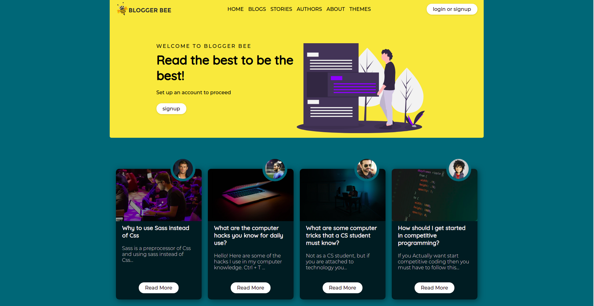

A simple template for blog site.
 

<h2>HOW TO VIEW THE wEBSITE?</h2>
 
Clone the repository and open the templates folder. Now open the <a href="templates/index.html">index.html</a> file with a browser.
 
 
<h2>PREVIEW</h2>
 

